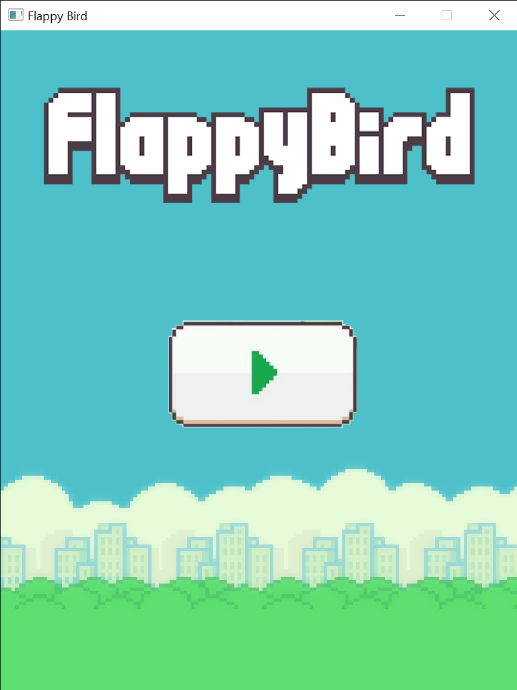
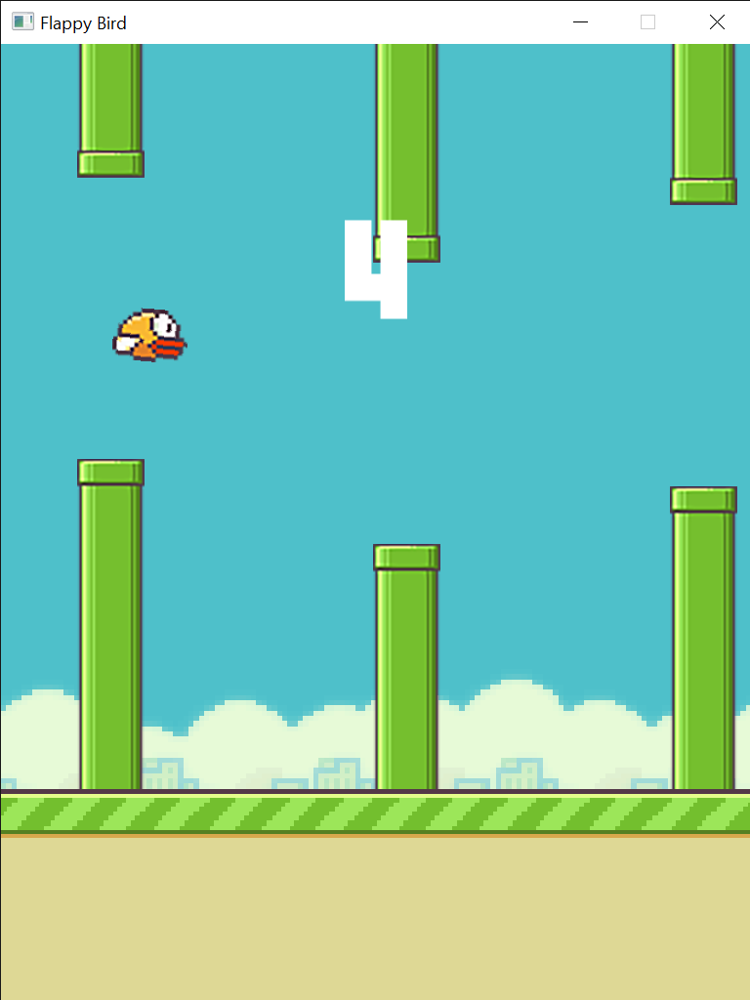
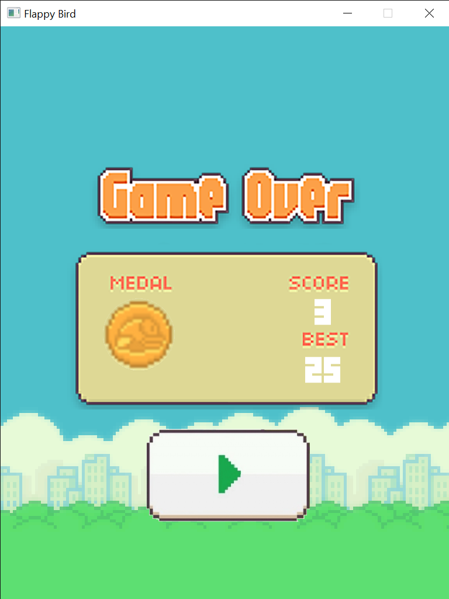

# C++ Flappy Bird Game using SFML 

This project is fully functional Flappy Bird Game Clone where the player attempts to control the flight of a bird to avoid collision with
green pipes that are randomly spawned. It includes features such as a high score board, background sounds and cool animations.  

Check out the Game Play Video.mp4 file to see a video of the game being played!

 
 
 
